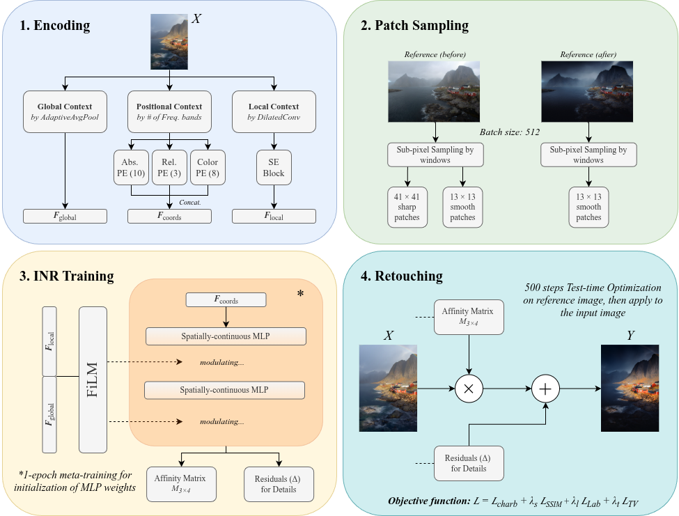

# MetaDC-INR

> **Task-Adaptive Meta-Learning for Disentangled Contextual Retouching Transfer**

🏆 **Winner of the NTIRE 2026 Photography Retouching Transfer Challenge**



MetaDC-INR is a hybrid INR + CNN framework for deterministic photo retouching transfer.  
It disentangles contextual style descriptors from spatially-continuous structural adjustments by combining a dual-branch feature extractor with a FiLM-modulated implicit neural representation (INR), trained via the Reptile meta-learning algorithm for rapid test-time adaptation.

For the full technical description, see [`TECHNICAL_REPORT.md`](TECHNICAL_REPORT.md).

| Reference Before | Reference After | Input Image | Our Result |
| :---: | :---: | :---: | :---: |
|  |  |  |  |

---

### Quick Start (inference only)

```bash
python predict.py \
    --dataset_path data/Automatic_Evaluation_Data/ \
    --output_path results/competition/ \
    --load_meta weights/meta_model_ft.pth \
    --steps 500
```

---

## Repository Structure

```
inr-retouching/
├── model.py              # InRetouchNR architecture (FiLM-MLP + dual-branch CNN)
├── dataset.py            # Dataset classes for training, benchmark, and competition data
├── meta_train.py         # Reptile meta-training loop
├── predict.py            # TTO inference for competition evaluation data
├── main.py               # TTO inference for benchmark data (with metrics)
├── evaluate_saved.py     # Evaluate pre-saved results against ground truth
├── weights/              # Pre-trained meta-model checkpoints
└── data/                 # Dataset root (not tracked)
```

---

## Requirements

- Python ≥ 3.8
- PyTorch ≥ 1.12 (with CUDA recommended)
- torchvision
- kornia
- lpips
- scikit-image
- Pillow
- tqdm

Install all dependencies:

```bash
pip install torch torchvision kornia lpips scikit-image Pillow tqdm
```

---

## Dataset Preparation

Place the PRT competition dataset under `data/` with the following structure:

```
data/
├── Train/
│   ├── natural/            # Input images
│   └── Presets/
│       ├── Preset_1/       # Retouched targets per preset
│       ├── Preset_2/
│       └── ...
├── Benchmark/
│   ├── Test/
│   │   ├── natural/
│   │   └── Presets/
│   ├── Test_References/
│   │   ├── natural/
│   │   └── Presets/
│   └── references_file.txt
└── Automatic_Evaluation_Data/      # Competition evaluation samples
    ├── sample1/
    │   ├── sample1_input.jpg
    │   ├── sample1_before.jpg
    │   └── sample1_after.jpg
    ├── sample2/
    └── ...
```

---

## 1. Meta-Training (Reptile)

The `meta_train.py` script runs the Reptile meta-learning loop over the full training set to produce a task-agnostic weight initialization.

### Usage

```bash
python meta_train.py --dataset_path data/
```

### All Arguments

| Argument | Type | Default | Description |
|:---|:---|:---|:---|
| `--dataset_path` | `str` | **(required)** | Root path to the dataset (must contain `Train/`, `Benchmark/`, etc.) |
| `--epochs` | `int` | `1` | Number of meta-epochs over the full task set |
| `--inner_steps` | `int` | `12` | Number of inner-loop adaptation steps per task |
| `--inner_lr` | `float` | `1e-3` | Learning rate for the inner-loop (Adam) |
| `--meta_lr` | `float` | `0.05` | Reptile outer-loop step size (linearly decayed) |
| `--batch_size` | `int` | `512` | Number of sub-pixel patch samples per inner step |
| `--window_size` | `int` | `13` | Smooth INR patch size (px); context patch = `window_size + 28` |
| `--gpu` | `int` | `0` | GPU device index |
| `--save_freq` | `int` | `100` | Save a checkpoint every N tasks |
| `--vis_freq` | `int` | `4000` | Save a trajectory visualization strip every N tasks |

### Outputs

- `meta_model_ft_latest.pth` — periodic checkpoint (every `--save_freq` tasks)
- `meta_model_ft.pth` — final meta-trained weights
- `meta_vis/` — trajectory visualization strips (input → GT → step 0 → step 3 → step 6 → final)

### Example

```bash
# Full meta-training run on GPU 0
python meta_train.py \
    --dataset_path data/ \
    --epochs 1 \
    --inner_steps 12 \
    --meta_lr 0.05 \
    --batch_size 512 \
    --gpu 0
```

---

## 2. TTO Prediction

The `predict.py` script runs test-time optimization (TTO) per sample for the competition evaluation data. It loads the meta-trained weights and adapts to each (reference_before, reference_after) pair, then applies the learned retouching to the input image.

### Usage

```bash
python predict.py \
    --dataset_path data/Automatic_Evaluation_Data/ \
    --output_path results/competition/ \
    --load_meta meta_model_ft.pth
```

### All Arguments

| Argument | Type | Default | Description |
|:---|:---|:---|:---|
| `--dataset_path` | `str` | **(required)** | Path to competition evaluation data (contains `sampleX/` subdirs) |
| `--output_path` | `str` | **(required)** | Directory to save retouched outputs (lossless PNG) |
| `--steps` | `int` | `500` | Number of TTO optimization steps per sample |
| `--batch_size` | `int` | `512` | Number of sub-pixel patch samples per TTO step |
| `--window_size` | `int` | `13` | Smooth INR patch size (px) |
| `--lr` | `float` | `1e-3` | TTO learning rate (Adam, cosine-annealed to `1e-4`) |
| `--load_meta` | `str` | `meta_model_ft.pth` | Path to the meta-trained checkpoint |
| `--gpu` | `int` | `0` | GPU device index |
| `--overwrite` | flag | `false` | If set, re-process samples that already have saved outputs |

### Output

Retouched images are saved as lossless PNGs:
```
results/competition/
├── sample1_retouched.png
├── sample2_retouched.png
└── ...
```

### Example

```bash
# Run TTO with 500 steps using a specific checkpoint
python predict.py \
    --dataset_path data/Automatic_Evaluation_Data/ \
    --output_path results/competition/ \
    --load_meta weights/meta_model_ft_latest.pth \
    --steps 500 \
    --batch_size 512 \
    --gpu 0
```

---

## 3. Benchmark with Metrics

The `main.py` script performs the same TTO loop but on the benchmark dataset, computing PSNR / SSIM / LPIPS against ground truth after each sample.

### Usage

```bash
python main.py \
    --dataset_path data/ \
    --output_path results/benchmark/ \
    --load_meta meta_model_ft.pth
```

### All Arguments

| Argument | Type | Default | Description |
|:---|:---|:---|:---|
| `--dataset_path` | `str` | **(required)** | Root dataset path (must contain `Benchmark/`) |
| `--output_path` | `str` | **(required)** | Directory to save retouched outputs |
| `--steps` | `int` | `500` | Number of TTO steps per sample |
| `--batch_size` | `int` | `484` | Number of sub-pixel patch samples per TTO step |
| `--window_size` | `int` | `13` | Smooth INR patch size (px) |
| `--lr` | `float` | `1e-3` | TTO learning rate |
| `--load_meta` | `str` | `None` | Path to meta-trained checkpoint (optional) |
| `--gpu` | `int` | `0` | GPU device index |
| `--overwrite` | flag | `false` | Re-process existing outputs |
| `--skip_save` | flag | `false` | Skip saving output images (metrics only) |

---

## 4. Evaluate Saved Results

The `evaluate_saved.py` script computes PSNR / SSIM / LPIPS on pre-saved results against ground truth, without re-running TTO.

### Usage

```bash
python evaluate_saved.py \
    --results_path results/benchmark/ \
    --dataset_path data/
```

### Arguments

| Argument | Type | Default | Description |
|:---|:---|:---|:---|
| `--results_path` | `str` | `Results` | Directory containing saved retouched outputs (organized by preset) |
| `--dataset_path` | `str` | **(required)** | Root dataset path (for ground truth lookup) |

---

## Citation

Not available yet.
