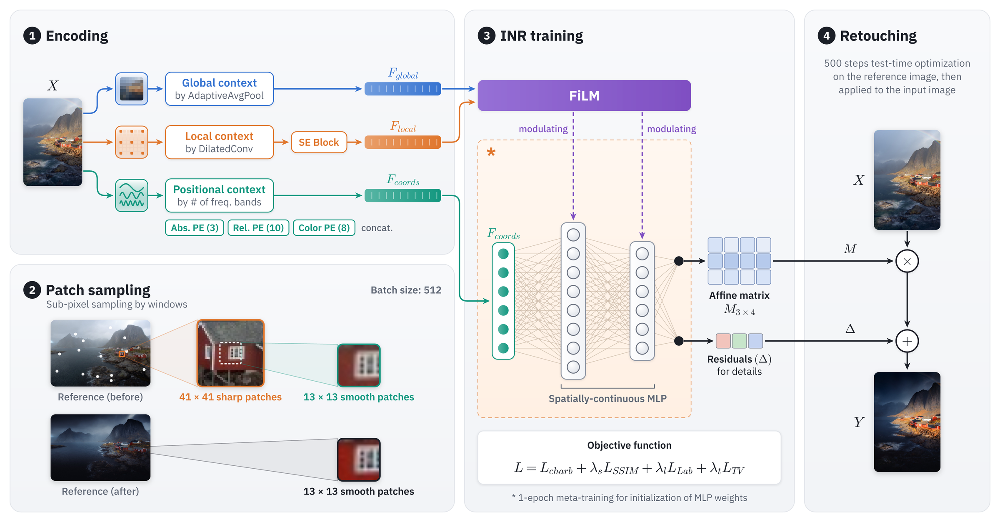

# MetaDC-INR

> **Task-Adaptive Meta-Learning for Disentangled Contextual Retouching Transfer**

🏆 **Winner of the NTIRE 2026 Photography Retouching Transfer Challenge**



*Architecture of MetaDC-INR (Fig. 2 of the paper; vector version: [`data/arch.svg`](data/arch.svg)).*

MetaDC-INR is a hybrid INR + CNN framework for deterministic photo retouching transfer.  
It disentangles contextual style descriptors from spatially-continuous structural adjustments by combining a dual-branch feature extractor with a FiLM-modulated implicit neural representation (INR), trained via the Reptile meta-learning algorithm for rapid test-time adaptation.

For the full technical description, see [`TECHNICAL_REPORT.md`](TECHNICAL_REPORT.md).

| Reference Before | Reference After | Input Image | Our Result |
| :---: | :---: | :---: | :---: |
|  |  |  |  |

---

### Quick Start (inference only)

```bash
python predict.py \
    --dataset_path data/Automatic_Evaluation_Data/ \
    --output_path results/competition/ \
    --load_meta weights/meta_model_ft.pth \
    --steps 500
```

---

## Repository Structure

```
MetaDC-INR-retouching-transfer/
├── model.py              # InRetouchNR architecture (FiLM-MLP + dual-branch CNN)
├── model_ablate.py       # Component-ablation variants of InRetouchNR (Table 3); ablate=None is identical to model.py
├── dataset.py            # Dataset classes for training, benchmark, and competition data
├── meta_train.py         # Reptile meta-training loop (also trains the ablation variants)
├── predict.py            # TTO inference for competition evaluation data
├── main.py               # TTO inference for benchmark data (with metrics)
├── evaluate_saved.py     # Evaluate pre-saved results against ground truth
├── utils/                # Shared losses (Charbonnier, composite objective) and metrics (PSNR, SSIM, ΔE)
├── scripts_benchmarking/ # Benchmark, ablation, IFFI, runtime and training-cost scripts (see below)
├── scripts_visualization/# Figure scripts
├── weights/              # meta_model_ft.pth (released); other checkpoints are git-ignored
└── data/                 # Architecture figure and sample images; datasets are not tracked
```

---

## Requirements

Tested with Python 3.11, PyTorch 2.x and CUDA 12.6.

```bash
pip install -r requirements.txt
```

---

## Dataset Preparation

Place the PRT competition dataset under `data/` with the following structure:

```
data/
├── Train/
│   ├── natural/            # Input images
│   └── Presets/
│       ├── Preset_1/       # Retouched targets per preset
│       ├── Preset_2/
│       └── ...
├── Benchmark/
│   ├── Test/
│   │   ├── natural/
│   │   └── Presets/
│   ├── Test_References/
│   │   ├── natural/
│   │   └── Presets/
│   └── references_file.txt
└── Automatic_Evaluation_Data/      # Competition evaluation samples
    ├── sample1/
    │   ├── sample1_input.jpg
    │   ├── sample1_before.jpg
    │   └── sample1_after.jpg
    ├── sample2/
    └── ...
```

---

## 1. Meta-Training (Reptile)

The `meta_train.py` script runs the Reptile meta-learning loop over the full training set to produce a task-agnostic weight initialization.

### Usage

```bash
python meta_train.py --dataset_path data/
```

### All Arguments

| Argument | Type | Default | Description |
|:---|:---|:---|:---|
| `--dataset_path` | `str` | **(required)** | Root path to the dataset (must contain `Train/`, `Benchmark/`, etc.) |
| `--epochs` | `int` | `1` | Number of meta-epochs over the full task set |
| `--inner_steps` | `int` | `12` | Number of inner-loop adaptation steps per task |
| `--inner_lr` | `float` | `1e-3` | Learning rate for the inner-loop (Adam) |
| `--meta_lr` | `float` | `0.05` | Reptile outer-loop step size (linearly decayed) |
| `--batch_size` | `int` | `512` | Number of sub-pixel patch samples per inner step |
| `--window_size` | `int` | `13` | Smooth INR patch size (px); context patch = `window_size + 28` |
| `--gpu` | `int` | `0` | GPU device index |
| `--save_freq` | `int` | `100` | Save a checkpoint every N tasks |
| `--vis_freq` | `int` | `4000` | Save a trajectory visualization strip every N tasks |
| `--ablate` | `str` | `None` | Train a component-ablation variant (`no_global`, `no_local`, `naive_coords`, `single_scale`, `concat_cond`; see `model_ablate.py`) |
| `--out_prefix` | `str` | `None` | Checkpoint name prefix (`<prefix>_latest.pth`, `<prefix>_final.pth`); default names are unchanged |
| `--resume_from` / `--resume_at` | `str` / `int` | `None` / `0` | Resume from a periodic checkpoint, skipping the first N tasks |
| `--task_seed` | `int` | `None` | Seed of the task order, so that a resumed run revisits the same order |
| `--overwrite` | flag | `false` | Allow overwriting an existing checkpoint (otherwise a timestamped name is used) |

### Outputs

- `meta_model_ft_latest.pth` — periodic checkpoint (every `--save_freq` tasks)
- `meta_model_ft.pth` — final meta-trained weights
- `meta_vis/` — trajectory visualization strips (input → GT → step 0 → step 3 → step 6 → final)

### Example

```bash
# Full meta-training run on GPU 0
python meta_train.py \
    --dataset_path data/ \
    --epochs 1 \
    --inner_steps 12 \
    --meta_lr 0.05 \
    --batch_size 512 \
    --gpu 0
```

---

## 2. TTO Prediction

The `predict.py` script runs test-time optimization (TTO) per sample for the competition evaluation data. It loads the meta-trained weights and adapts to each (reference_before, reference_after) pair, then applies the learned retouching to the input image.

### Usage

```bash
python predict.py \
    --dataset_path data/Automatic_Evaluation_Data/ \
    --output_path results/competition/ \
    --load_meta meta_model_ft.pth
```

### All Arguments

| Argument | Type | Default | Description |
|:---|:---|:---|:---|
| `--dataset_path` | `str` | **(required)** | Path to competition evaluation data (contains `sampleX/` subdirs) |
| `--output_path` | `str` | **(required)** | Directory to save retouched outputs (lossless PNG) |
| `--steps` | `int` | `500` | Number of TTO optimization steps per sample |
| `--batch_size` | `int` | `512` | Number of sub-pixel patch samples per TTO step |
| `--window_size` | `int` | `13` | Smooth INR patch size (px) |
| `--lr` | `float` | `1e-3` | TTO learning rate (Adam, cosine-annealed to `1e-4`) |
| `--load_meta` | `str` | `meta_model_ft.pth` | Path to the meta-trained checkpoint |
| `--gpu` | `int` | `0` | GPU device index |
| `--overwrite` | flag | `false` | If set, re-process samples that already have saved outputs |

### Output

Retouched images are saved as lossless PNGs:
```
results/competition/
├── sample1_retouched.png
├── sample2_retouched.png
└── ...
```

### Example

```bash
# Run TTO with 500 steps using a specific checkpoint
python predict.py \
    --dataset_path data/Automatic_Evaluation_Data/ \
    --output_path results/competition/ \
    --load_meta weights/meta_model_ft.pth \
    --steps 500 \
    --batch_size 512 \
    --gpu 0
```

---

## 3. Benchmark with Metrics

The `main.py` script performs the same TTO loop but on the benchmark dataset, computing PSNR / SSIM / LPIPS against ground truth after each sample.

### Usage

```bash
python main.py \
    --dataset_path data/ \
    --output_path results/benchmark/ \
    --load_meta meta_model_ft.pth
```

### All Arguments

| Argument | Type | Default | Description |
|:---|:---|:---|:---|
| `--dataset_path` | `str` | **(required)** | Root dataset path (must contain `Benchmark/`) |
| `--output_path` | `str` | **(required)** | Directory to save retouched outputs |
| `--steps` | `int` | `500` | Number of TTO steps per sample |
| `--batch_size` | `int` | `484` | Number of sub-pixel patch samples per TTO step |
| `--window_size` | `int` | `13` | Smooth INR patch size (px) |
| `--lr` | `float` | `1e-3` | TTO learning rate |
| `--load_meta` | `str` | `None` | Path to meta-trained checkpoint (optional) |
| `--gpu` | `int` | `0` | GPU device index |
| `--overwrite` | flag | `false` | Re-process existing outputs |
| `--skip_save` | flag | `false` | Skip saving output images (metrics only) |

---

## 4. Evaluate Saved Results

The `evaluate_saved.py` script computes PSNR / SSIM / LPIPS on pre-saved results against ground truth, without re-running TTO.

### Usage

```bash
python evaluate_saved.py \
    --results_path results/benchmark/ \
    --dataset_path data/
```

### Arguments

| Argument | Type | Default | Description |
|:---|:---|:---|:---|
| `--results_path` | `str` | `Results` | Directory containing saved retouched outputs (organized by preset) |
| `--dataset_path` | `str` | **(required)** | Root dataset path (for ground truth lookup) |

---

## 5. Reproducing the paper

All scripts take the Retouch Transfer Dataset root (`<RTD>`, containing `Train/`, `Validation/`, `Benchmark/`).
TTO uses Adam at lr 1e-3, batch 512 and window 13 throughout, with the Charbonnier objective of Section 3.6.

| Paper result | Command |
|:---|:---|
| Table 1 (RTD benchmark, 10/100/500 steps) | `python scripts_benchmarking/benchmark.py --dataset_path <RTD> --steps_list 10,100,500` |
| Table 1 dispersion (three runs per budget) | run the command above three times; each run reports its mean over 1,342 tasks |
| Table 3 (component ablation) | `bash scripts_benchmarking/run_component_ablation.sh <RTD> <variant>` for `no_global`, `no_local`, `naive_coords`, `single_scale`, `concat_cond` |
| Table 4 (capacity) | d = 128 is the released `weights/meta_model_ft.pth` (Table 1 command at 100 steps); the d = 64 checkpoint is not released |
| Table 5 (runtime and memory) | `python scripts_benchmarking/profile_runtime.py --rtd <RTD> --steps <10/100/500> --out_dir results/profile` (add `--hidden_dim 64` for the d=64 row) |
| Table 6 (zero-shot IFFI) | `python scripts_benchmarking/benchmark_iffi.py --iffi_root <IFFI>/test --steps_list 10,100,200,500 --out_dir results/iffi` |
| Fig. 5 (convergence profiling) | `python scripts_benchmarking/profile_convergence.py --dataset_path <RTD>` |
| Fig. 7 (meta-initialization vs. supervised pre-training) | `python scripts_benchmarking/ablation_meta_vs_baselines.py --dataset_path <RTD>` |
| Training cost of supervised pre-training (Section 4.4.3) | `python scripts_benchmarking/supervised_timing.py --dataset_path <RTD> --optimizer adam --epochs 12` |

Baseline rows in Tables 1 and 2 are the published values of the respective papers and of the NTIRE 2026 challenge report.
The INRetouch rows of Tables 5 and 6 and the Team A row of Table 5 were produced with those methods' own code, which is not part of this repository.
See [`ABLATION_STUDIES.md`](ABLATION_STUDIES.md) for the ablation variants and the earlier ablation scripts.

---

## 6. Results

### Table 1. RTD benchmark
MetaDC-INR values are mean ± standard deviation over three independent runs.

| **Type** | **Method** | **PSNR ↑** | **SSIM ↑** | **LPIPS ↓** |
|:---|:---:|:---:|:---:|:---:|
| Full Data Training | StyleGAN | 20.63 | 0.758 | 0.195 |
|  | Deep Preset | 21.94 | 0.772 | 0.186 |
|  | Neural Preset | 22.16 | 0.769 | 0.176 |
| Example-Based | Image Analogies | 12.32 | 0.403 | 0.769 |
| (No Training) | Deep Image Analogies | 12.76 | 0.319 | 0.747 |
|  | Painter | 12.20 | 0.350 | 0.779 |
|  | Visual Prompting | 14.61 | 0.412 | 0.632 |
| INR-Based | LTE | 16.23 | 0.609 | 0.376 |
| (One-Shot TTO) | CiaoSR | 19.11 | 0.693 | 0.227 |
|  | LIT | 18.50 | 0.655 | 0.309 |
|  | INRetouch | 23.42 | 0.805 | 0.149 |
| **MetaDC-INR** | 10-step TTO | 23.39 ± 0.01 | 0.8215 ± 0.0001 | 0.1482 ± 0.0001 |
| (*ours*) | 100-step TTO | **23.98 ± 0.01** | 0.8394 ± 0.0002 | **0.1324 ± 0.0001** |
|  | 500-step TTO | 23.85 ± <0.01 | **0.8404 ± 0.0001** | 0.1330 ± <0.0001 |

### Table 2. NTIRE 2026 Photography Retouching Transfer Challenge
Official results from the challenge report; competing teams are anonymized.

| **Method** | **MOS ↑** | **PSNR ↑** | **TTO Steps ↓** |
|:---|:---:|:---:|:---:|
| INRetouch | 122 | 21.07 | 1,000 |
| Team E | 162 | 21.37 | 5,000 |
| Team D | 189 | 21.45 | **400** |
| Team C | 194 | 21.74 | 10,000 |
| Team B | 249 | 21.69 | 27,000 |
| Team A | 263 | 21.52 | 1,500 |
| MetaDC-INR | **269** | **21.87** | 500 |

### Table 3. Component ablation (RTD, 100 TTO steps)
Each variant removes or replaces one component and is meta-trained under the same protocol as the full model.

|  | **Params** | **PSNR ↑** | **Δ** | **SSIM ↑** | **LPIPS ↓** |
|:---|:---:|:---:|:---:|:---:|:---:|
| Full model | 0.49M | **23.98** | – | **0.8394** | **0.1324** |
| w/o global branch | 0.38M | 23.93 | −0.05 | 0.8372 | 0.1332 |
| FiLM → concat. | 0.30M | 23.85 | −0.13 | 0.8352 | 0.1347 |
| Single-scale patch | 0.49M | 23.74 | −0.24 | 0.8322 | 0.1370 |
| Raw coordinates | 0.47M | 23.65 | −0.33 | 0.8356 | 0.1355 |
| w/o local branch | 0.38M | 23.26 | −0.72 | 0.8107 | 0.1503 |

### Table 4. Architectural capacity

|  | **Params** | **PSNR ↑** | **SSIM ↑** | **LPIPS ↓** |
|:---|:---:|:---:|:---:|:---:|
| d = 64 | 0.14M | 23.81 | 0.829 | 0.139 |
| d = 128 | 0.49M | **23.98** | **0.839** | **0.132** |

### Table 5. Runtime and memory
NVIDIA RTX 2080 Ti, end-to-end at native resolution (768 × 512). Times in seconds; Mem. is peak GPU memory in GiB.

| **Method** | **Steps** | **Prep.** | **Fit.** | **Render** | **Total ↓** | **Mem. ↓** |
|:---|:---:|:---:|:---:|:---:|:---:|:---:|
| INRetouch | 1,000 | 1.17 | 5.06 | 0.02 | 6.25 | 2.14 |
| Team A | 1,500 | 1.18 | 27.70 | 0.04 | 28.92 | 2.44 |
| *MetaDC-INR (ours)* |  |  |  |  |  |  |
| &nbsp;&nbsp;&nbsp;d=128 | 10 | 0.03 | 1.32 | 0.06 | **1.41** | 3.82 |
| &nbsp;&nbsp;&nbsp;d=64 | 100 | 0.03 | 6.31 | 0.03 | 6.37 | **2.01** |
| &nbsp;&nbsp;&nbsp;d=128 | 100 | 0.03 | 13.28 | 0.06 | 13.37 | 3.82 |
| &nbsp;&nbsp;&nbsp;d=128 | 500 | 0.03 | 66.50 | 0.06 | 66.59 | 3.82 |

At 10 steps MetaDC-INR completes a transfer in 1.41 s, 4.4 times faster than INRetouch (6.25 s), while already exceeding it on SSIM and LPIPS.
At 100 steps the 128-dimensional model takes 13.37 s and is slower than INRetouch, but improves on it on all three metrics.

### Table 6. Zero-shot generalization to IFFI
1,408 tasks (88 images × 16 Instagram filters), longest side 768 pixels; no IFFI data is used in training.

| **Method** | **Steps** | **PSNR ↑** | **SSIM ↑** | **LPIPS ↓** |
|:---|:---:|:---:|:---:|:---:|
| INRetouch | 1,000 | **32.11** | 0.9505 | 0.0343 |
| INRetouch | 100 | 25.97 | 0.9206 | 0.0757 |
| INRetouch | 10 | 21.35 | 0.8975 | 0.1270 |
| *MetaDC-INR (ours)* |  |  |  |  |
| &nbsp;&nbsp;&nbsp;d=128 | 500 | 31.76 | 0.9545 | 0.0343 |
| &nbsp;&nbsp;&nbsp;d=128 | 200 | 31.60 | **0.9546** | **0.0338** |
| &nbsp;&nbsp;&nbsp;d=128 | 100 | 31.16 | 0.9534 | 0.0350 |
| &nbsp;&nbsp;&nbsp;d=128 | 10 | 27.69 | 0.9403 | 0.0560 |

### Test-time optimization analysis (Figs. 5–7)
- A randomly initialized model starts optimization at about 13.5 dB PSNR; MetaDC-INR starts substantially higher and reaches a stable plateau within about 100 steps.
- Against SGD-, Adam- and AdamW-pre-trained initializations (12 epochs of supervised pre-training), the meta-learned prior converges with a slope of 1.241 dB/step over the first 10 steps and keeps a higher PSNR plateau throughout.

---

## Citation

MetaDC-INR won the NTIRE 2026 Photography Retouching Transfer Challenge. Until the MetaDC-INR paper is published, please cite the challenge report:

```bibtex
@inproceedings{elezabi2026photography,
  title={Photography Retouching Transfer, NTIRE 2026 Challenge: Report},
  author={Elezabi, Omar and Conde, Marcos V and Wu, Zongwei and Jin, Yeying and Timofte, Radu and Kinli, Furkan and Xu, Cong and Luo, Pu and Li, Yumei and Zhou, Wei and others},
  booktitle={Proceedings of the IEEE/CVF Conference on Computer Vision and Pattern Recognition},
  pages={1796--1806},
  year={2026}
}
```
